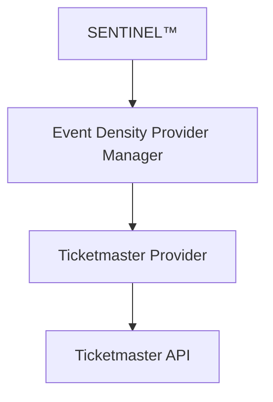

# Ticketmaster Event Density Provider Adapter

Event Density provider scaffold for the GÖ.AI Backend.

This provider is intelligence-first. It supports SENTINEL™ event density analysis, movement impact assessment, and future ETAS™ ticketing execution.

## Resource Files

- events.js
- venues.js
- search.js
- categories.js
- tickets.js
- calendar.js
- density.js
- impact.js
- webhooks.js
