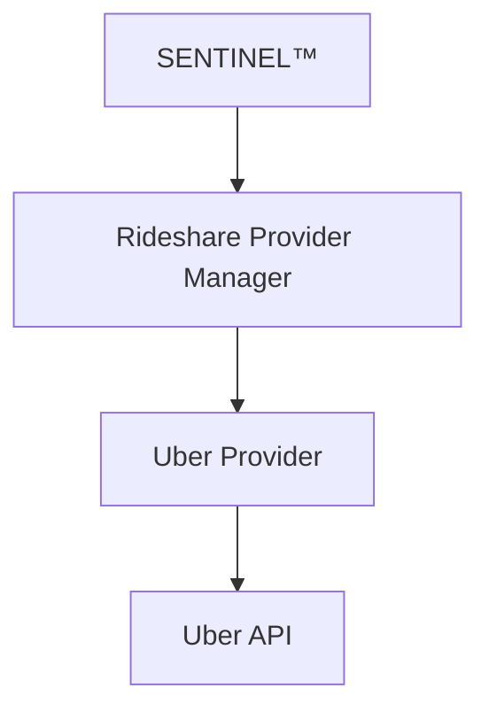

# Uber Provider Adapter

Uber scaffold for the GÖ.AI Backend.

```mermaid
flowchart TD
    A[SENTINEL™]
    B[Rideshare Provider Manager]
    C[Uber Provider]
    D[Uber API]

    A --> B
    B --> C
    C --> D
```

## Resources

- rides
- ride-types
- estimates
- drivers
- pricing
- bookings
- cancellations
- webhooks
