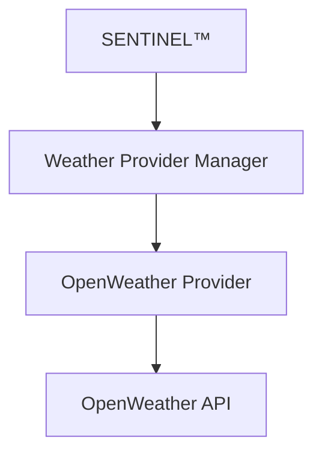

# OpenWeather Provider Adapter

OpenWeather scaffold for the GÖ.AI Backend.

```mermaid
flowchart TD
    A[SENTINEL™]
    B[Weather Provider Manager]
    C[OpenWeather Provider]
    D[OpenWeather API]

    A --> B
    B --> C
    C --> D
```

## Resources

- weather
- forecast
- alerts
- geocoding
- air-quality
- one-call
