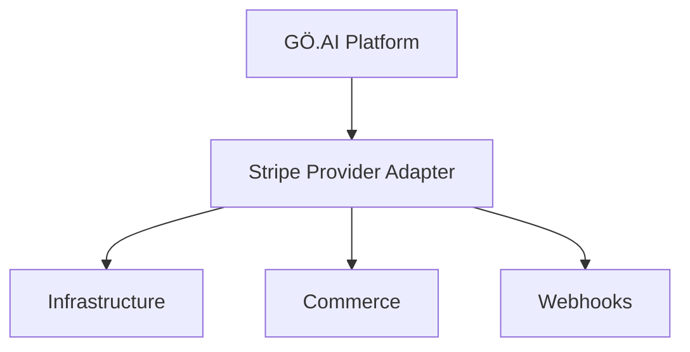
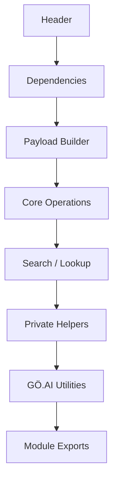
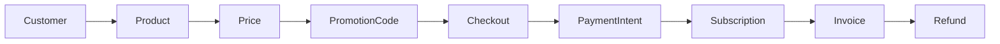
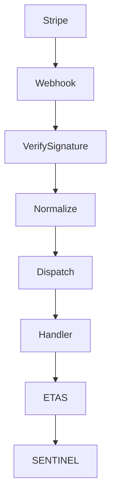
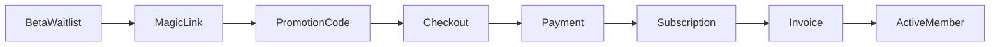
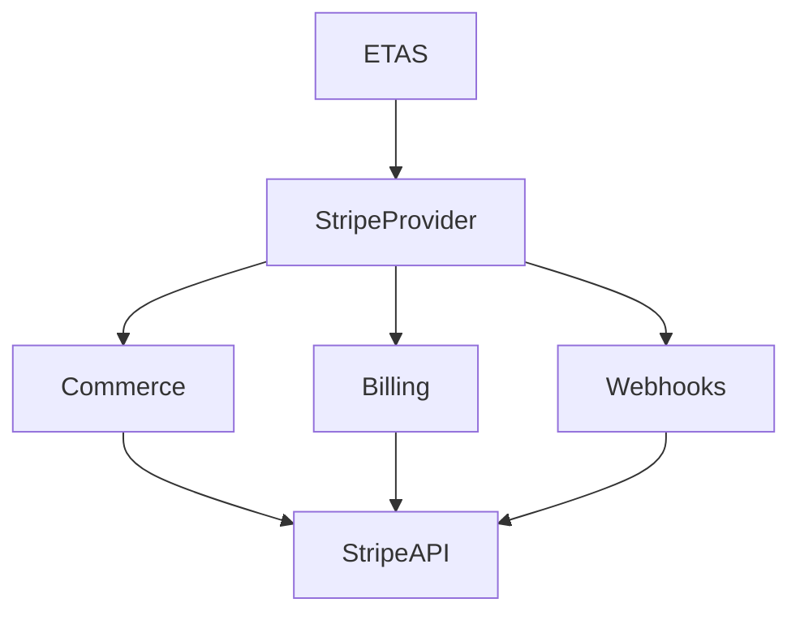
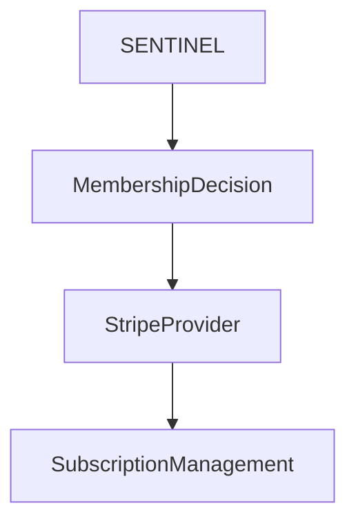

# Stripe Provider Adapter

Enterprise Stripe integration for the **GÖ.AI Backend**.

The Stripe Provider Adapter provides a modular abstraction over the Stripe API and serves as the payment engine for **ETAS™** and **SENTINEL™**.

---

# Overview

The adapter standardizes Stripe operations behind a provider interface so the remainder of the GÖ.AI platform never communicates directly with Stripe.

Supported capabilities include:

- Product Management
- Pricing
- Promotion Codes
- Customer Management
- Checkout Sessions
- Payment Intents
- Subscription Management
- Invoice Management
- Refund Management
- Webhook Processing

---

# Architecture



---

# Provider Layout

```text
stripe/
│
├── config.js
├── client.js
├── constants.js
├── validators.js
├── normalize.js
├── types.js
├── errors.js
├── index.js
│
├── products.js
├── promotioncodes.js
├── customers.js
├── checkout.js
├── paymentintents.js
├── subscriptions.js
├── invoices.js
├── refunds.js
├── webhooks.js
│
├── __mocks__/
├── tests/
│
├── jest.config.js
├── jest.setup.js
│
├── README.md
└── CHANGELOG.md
```

---

# Module Architecture



---

# Commerce Flow



---

# Webhook Flow



---

# Membership Lifecycle



---

# Integration with ETAS™



---

# Integration with SENTINEL™


