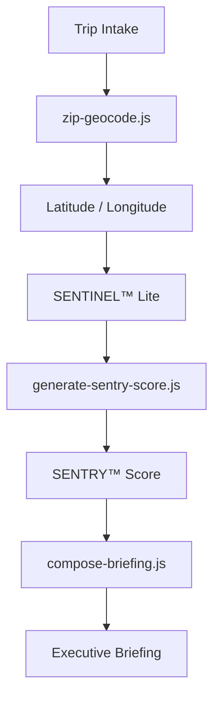
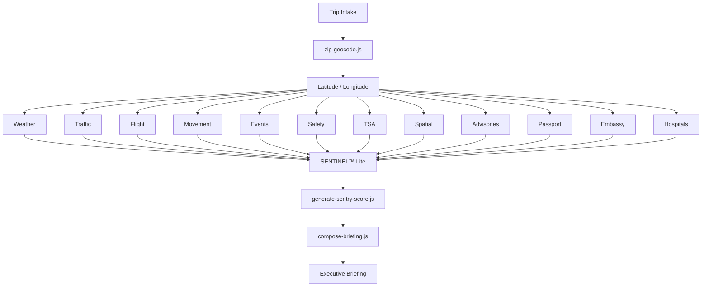

# SENTRY™ Score Generation Architecture

The original `sentinel-score.js` function served as a demonstration using hard-coded ZIP codes and static risk values.

Rather than replacing this functionality, the file will be repurposed and renamed as:

```text
generate-sentry-score.js
```

Its responsibility is no longer to look up scores.

Instead, it becomes the central scoring engine responsible for combining the intelligence produced by **SENTINEL™ Lite** into a single **SENTRY™ Score**.

---

# System Workflow



---

# Category Intelligence Modules

```text
weather.js
└── providers/
    └── openweather.js

traffic.js
└── providers/
    ├── mapbox.js
    └── transitland.js

flight-intelligence.js
└── providers/
    ├── flightaware.js
    └── duffel.js

movement-intelligence.js
└── providers/
    ├── lyft.js
    ├── mapbox.js
    └── transitland.js

event-density.js
└── providers/
    ├── ticketmaster.js
    └── eventbrite.js

safety-security.js
└── providers/
    ├── gdelt.js
    ├── base-operations.js
    └── dhs.js

tsa.js
└── providers/
    ├── tsa-wait-times.js
    └── apify-tsa.js

spatial-intelligence.js
└── providers/
    ├── spexi.js
    └── niantic.js

travel-advisories.js

passport-requirements.js

embassies.js

hospitals.js
```

---

# Overall Architecture



---

# Responsibilities

## Provider Layer

Each provider is responsible only for communicating with a single external API.

Example:

```text
providers/openweather.js
```

Returns:

- Forecast
- Alerts
- Temperature
- Wind
- Visibility

**No scoring occurs here.**

---

## Category Layer

Each category combines one or more providers into a normalized intelligence object.

Example:

```text
safety-security.js
```

Combines:

- Base Operations
- GDELT
- DHS

Returns a single standardized **Safety & Security Assessment**.

The same pattern applies across:

- Weather
- Events
- TSA
- Flight Intelligence
- Movement Intelligence
- Spatial Intelligence

---

## SENTINEL™ Lite

SENTINEL™ Lite is the intelligence engine.

Responsibilities:

- Collect every intelligence layer
- Normalize inconsistent provider outputs
- Handle API failures
- Fall back to demonstration data when necessary
- Weight each intelligence category
- Produce a unified intelligence package

**No final score is produced here.**

---

## generate-sentry-score.js

This file calculates the final **SENTRY™ Score**.

### Inputs

- Weather
- Flight Intelligence
- Movement Intelligence
- Infrastructure
- Events
- Safety & Security
- TSA
- Spatial Intelligence
- Travel Advisories

### Outputs

- Overall SENTRY™ Score
- Status
- Color
- Contributor Scores
- Confidence
- Recommendations

---

# SENTRY™ Score Scale

| Score | Status | Color |
|-------:|--------|-------|
| 90–100 | Stable | 🟢 Green |
| 70–89 | Moderate | 🟡 Yellow |
| 40–69 | Elevated | 🟠 Orange |
| 0–39 | Critical | 🔴 Red |

Unlike the original demo, **a higher score indicates greater travel stability.**

---

# Example Output

```json
{
  "zip": "28202",
  "sentryScore": 87,
  "status": "STABLE",
  "color": "green",
  "contributors": {
    "weather": 92,
    "flight": 88,
    "movement": 81,
    "tsa": 77,
    "events": 75,
    "safety": 90,
    "spatial": 86,
    "infrastructure": 94
  },
  "summary": "...",
  "recommendations": [
    "...",
    "...",
    "..."
  ],
  "confidence": "live"
}
```

---

# Future Expansion

The architecture intentionally leaves every intelligence layer modular.

Initially, every category may return demonstration data.

As production APIs are connected, the internal implementation of each category changes while the interfaces to **SENTINEL™ Lite** and **`generate-sentry-score.js`** remain stable.

This allows the MVP to evolve incrementally without requiring changes to the orchestration layer or Executive Briefing generation.
